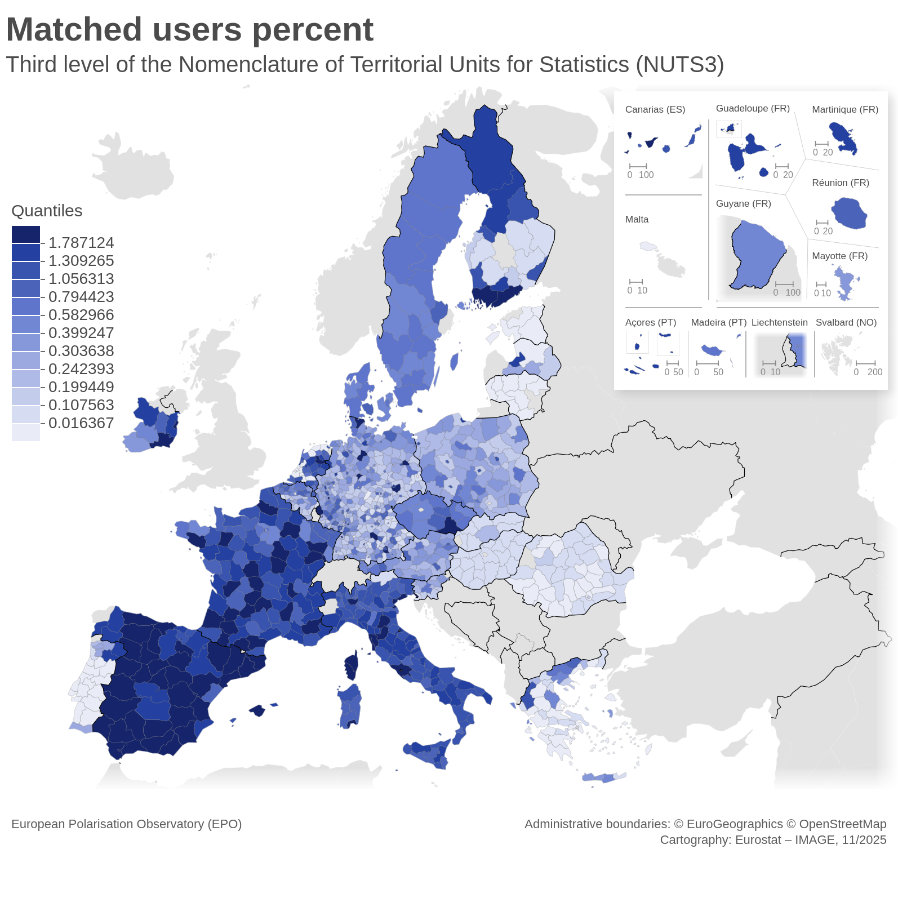
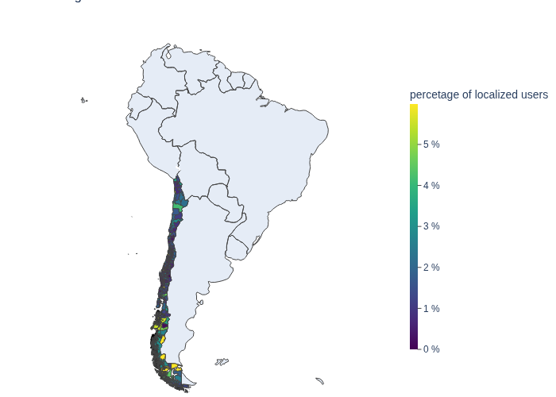

# Social Media Census project 🌎📊

## SomeCens package could be use to:

- Create a Demograph tree object representing a country and its hierarchical organized geographic units 🌐
- Load sociodemographic (age and gender) information for units 👶👧👵👦🧔👴
- Localize user in units 📌
- Create choropleth maps to show sociodemographic and localisation data 🗺️
- Export tables with localized user and units sociodemographic data 📊

### 📊 Currently used with data from 
| Country | Census |
| ------------- | ------ |
| 🇪🇺 EU countries | [NUTS 2024 classification](https://ec.europa.eu/eurostat/web/nuts) |
| 🇨🇱 Chile | [2024 Census](https://censo2024.ine.gob.cl/estadisticas/) |
| 🇺🇸 USA | [2023 Annual County Resident Population Estimate](https://www.census.gov/) |

Check the provided [scripts](https://github.com/jimenaRL/SoMeCens/tree/0fddfc2ff01611bf9f21af2a36b2e648b1e2bbd2/scripts) for data formatting.

### 📊 Example of Europe 2024 NUTS level 3 coverage with [EPO](http://ramaciotti.org/projects/project-2021-10-EPO/) data

 

 Image made with IMAGE [web-tool](https://gisco-services.ec.europa.eu/image/) from the Geographic Information System of the European Commission ([GISCO](https://ec.europa.eu/eurostat/web/gisco)).

### 📊 Example of Chile 2024 Census comunas coverage with [EPO](http://ramaciotti.org/projects/project-2021-10-EPO/) data

 

## 📁 Tables

For each country the _create_demograph.py_ script will generate the following tables, where {census} is the name of the census and its year and {metadata} is epo_{year} with the corresponding collection year: 

1. units_{census}.csv

   _Description_:
     Contains the geographical units structure, their demographics informations and statistics about the number of users matched.

   _Columns_:
     - level
     - code
     - parent_code
     - label
     - subunits
     - unit_nb_matchs
     - unit_percent_matched
     - descendants_nb_matchs
     - descendants_percent_matched
     - gender categories
     - age categories

2. localized_users_{census}\_{metadata}.csv

   _Description_:
     Contains each localized user and the units (code and label) where it was matched.

   _Columns_:
     -   twitter_id
     -   location
     -   screen_name
     -   normalized_location
     -   level_{n}_code
     -   level_{n}_label

3. localized_users_full_{census}\_{metadata}.csv

   _Description_:
     Contains each localized user and the code of the units where it was matched and all the hierarchical superior units. 

   _Columns_:
     -   twitter_id
     -   location
     -   screen_name
     -   normalized_location
     -   level_{n}_code

4. nb_matchs_perc_{country}\_{census}\_{metadata}\_{level}.csv 

   _Description_:
     Contains the percent of users matched over the total population for each unit in a level.
     This csv has no headers.
     It is usefull to create cloropleth maps. 

There is also a excel file named

5. {country}_units_users_reports\_{census}\_{metadata}.xlsx 

usefull to debug and to check things easily online in a google sheet file. It has one tab with the same informations as file 1. and another tab with the same structure of file 2. over a random sample of 10k users.

As an example, for Hungary we have the following files

1. units_nuts_2024.csv
2. localized_users_nuts_2024_epo_2023.csv
3. localized_users_full_nuts_2024_epo_2023.csv
4. nb_matchs_perc_hungary_nuts_2024_epo_2023_level_0.csv
nb_matchs_perc_hungary_nuts_2024_epo_2023_level_1.csv
nb_matchs_perc_hungary_nuts_2024_epo_2023_level_2.csv
nb_matchs_perc_hungary_nuts_2024_epo_2023_level_3.csv
5. hungary_units_users_reports_nuts_2024_epo_2023.xlsx
